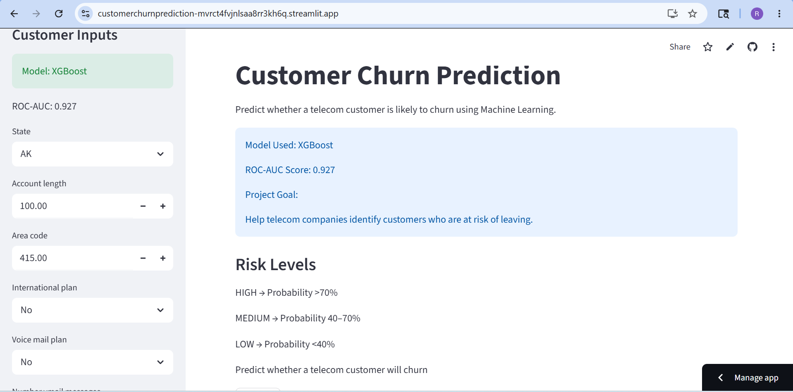
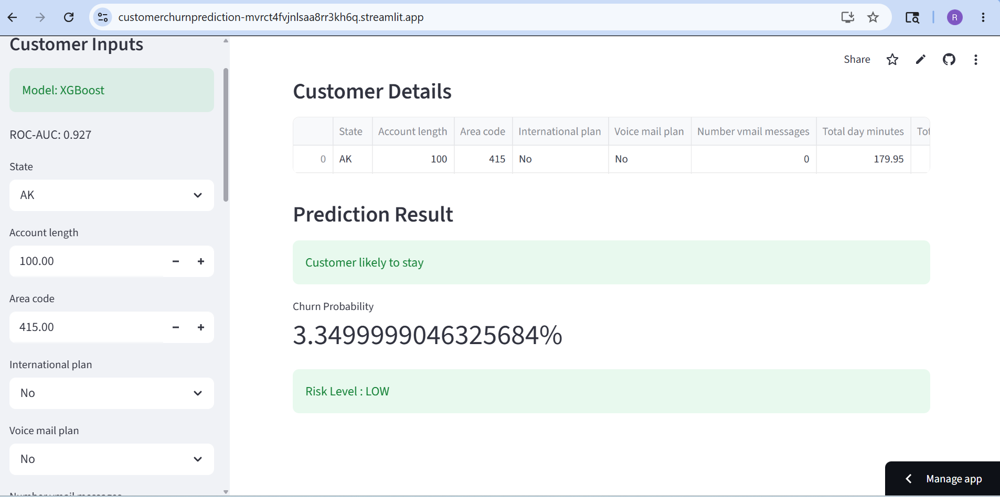

# Customer Churn Prediction – End-to-End Machine Learning Project

This project builds a complete machine learning pipeline to predict whether a telecom customer is likely to churn.

It demonstrates a full end-to-end ML workflow, including:

- Data exploration
- Data preprocessing
- Feature engineering
- Model comparison
- Hyperparameter tuning
- Final model training
- Prediction pipeline
- Deployment using a Streamlit web application

The goal is to help telecom companies identify customers who are at risk of leaving and take preventive actions to improve customer retention.

---

## 🚀 Live Demo

Try the deployed application here:

https://customerchurnprediction-mvrct4fvjnlsaa8rr3kh6q.streamlit.app/

---

## 📷 App Preview

### Home Page



### Customer Stay Prediction



### Customer Churn Prediction


---

## 📊 Project Overview

Customer churn prediction is one of the most common classification problems in machine learning.

This project follows real-world ML development practices:

- Exploratory Data Analysis (EDA)
- Data cleaning and preprocessing
- Feature engineering
- Model comparison using cross-validation
- Hyperparameter tuning
- Building a prediction pipeline
- Deploying the model using Streamlit

The final result is an interactive application that predicts whether a customer is likely to churn.

---

## ⚙️ Machine Learning Pipeline

The project follows this workflow:

```text
EDA
↓
Data Preprocessing
↓
Feature Engineering
↓
Model Comparison
↓
Hyperparameter Tuning
↓
Final Model Training
↓
Prediction Pipeline
↓
Streamlit Web Application
```

---

## 🧠 Models Evaluated

The following models were evaluated using 5-fold Stratified Cross Validation:

- Logistic Regression
- Decision Tree
- Random Forest
- K Nearest Neighbors
- XGBoost

Model performance was compared using:

- Accuracy
- Precision
- Recall
- F1 Score
- ROC-AUC

Final Model Used:

**XGBoost**

---

## 📈 Model Performance

| Model | Accuracy | Precision | Recall | F1 | ROC-AUC |
|--------|-----------|------------|---------|-----|----------|
| XGBoost | 0.9606 | 0.9252 | 0.7935 | 0.8539 | 0.9271 |
| RandomForest | 0.9315 | 0.9703 | 0.5452 | 0.6959 | 0.9249 |
| DecisionTree | 0.9212 | 0.7290 | 0.7355 | 0.7309 | 0.8441 |
| Logistic | 0.8673 | 0.6001 | 0.2710 | 0.3706 | 0.8184 |
| KNN | 0.8818 | 0.8455 | 0.2290 | 0.3596 | 0.7682 |

Final Model Selected:

**XGBoost**

XGBoost achieved the highest ROC-AUC score and provided the best balance between precision and recall.

---

## 📊 Model Comparison

Models were compared using Stratified K-Fold Cross Validation and ROC-AUC score.

XGBoost outperformed all baseline models and was selected as the final model.

---

## 📈 Feature Engineering

The following custom features were created:

### Total_Calls

```python
Total day calls +
Total eve calls +
Total night calls +
Total intl calls
```

### Total_minutes

```python
Total day minutes +
Total eve minutes +
Total night minutes +
Total intl minutes
```

### Service_pressure

```python
Customer service calls /
(Account length + 1)
```

### Call_Per_Day

```python
Total_Calls /
(Account length + 1)
```

### min_per_day

```python
Total_minutes /
(Account length + 1)
```

Feature engineering improved model performance and helped capture customer behavior patterns.

---

## ⚡ Quick Start

Follow these steps to run the project locally.

### 1️⃣ Clone repository

Repository:

```bash
git clone https://github.com/rahul-ml-engineer/customer_churn_prediction.git
```

```bash
cd customer_churn_prediction
```

---

### 2️⃣ Create virtual environment

```bash
python -m venv .venv
```

---

### 3️⃣ Activate environment

Windows:

```bash
.venv\Scripts\activate
```

Mac/Linux:

```bash
source .venv/bin/activate
```

---

### 4️⃣ Install dependencies

```bash
pip install -r requirements.txt
```

---

### 5️⃣ Train model

```bash
python src/train_model.py
```

---

### 6️⃣ Run Streamlit application

```bash
streamlit run app/app.py
```

Application opens at:

```text
http://localhost:8501
```

---

## 🖥 Streamlit Web Application

The Streamlit interface allows users to:

- Enter customer details
- Predict churn probability
- View risk level
- View prediction results instantly

Risk levels:

HIGH → Probability >70%

MEDIUM → Probability 40–70%

LOW → Probability <40%

---

## 🗂 Project Structure

```text
customer_churn_prediction
│
├── app
│   └── app.py
│
├── Data
│   ├── raw
│   │   ├── churn-bigml-80.csv
│   │   └── churn-bigml-20.csv
│   │
│   └── processed
│
├── images
│   ├── app_home.png
│   ├── churn_stay_result.png
│   └── churn_result.png
│
├── models
│   ├── Customer_Churn_Prediction.pkl
│   └── Customer_Churn_Model_Comparision.csv
│
├── src
│   ├── config.py
│   ├── preprocess.py
│   ├── feature_engineering.py
│   ├── model_comparison.py
│   ├── train_model.py
│   └── predict.py
│
├── requirements.txt
├── LICENSE
└── README.md
```

---

## 📚 Dataset

Dataset used:

Telecom Customer Churn Dataset

Files:

- churn-bigml-80.csv
- churn-bigml-20.csv

Contains customer usage behavior, service information, and churn labels.

---

## 🛠 Technologies Used

- Python
- Pandas
- NumPy
- Scikit-learn
- XGBoost
- Streamlit
- Joblib

---

## 📌 Key Learnings

This project demonstrates:

- Building an end-to-end machine learning pipeline
- Feature engineering
- Model comparison using cross validation
- Hyperparameter tuning
- Building prediction pipelines
- Deploying ML applications with Streamlit

---

## 👤 Author

Rahul

Machine Learning Engineer

GitHub:

https://github.com/rahul-ml-engineer

---

## ⭐ Future Improvements

Possible enhancements include:

- Add SHAP explainability
- Add FastAPI integration
- Add prediction history
- Add authentication system
- Add cloud deployment enhancements
